# 🚀 Missione Intergalattica – Il Centro Comandi Galattico (CCG)

Benvenuti, cadetti, al simulatore del **Centro Comandi Galattico (CCG)**!

Questo progetto è un'esercitazione pratica progettata per insegnare i fondamenti delle **architetture a microservizi**, **Apache Kafka** e **Docker** in modo divertente e interattivo. Invece di gestire noiosi "ordini" e "clienti", qui gestiremo flotte di navi spaziali, rotte interplanetarie e potenziali minacce aliene!

L'obiettivo è costruire un ecosistema di servizi che comunicano tramite eventi, ognuno con un ruolo specifico nella gestione di una missione galattica.

## ✨ Architettura del Sistema

Il nostro ecosistema si basa su una comunicazione asincrona tramite un message broker (Kafka). Le navi inviano comandi, e i vari dipartimenti del CCG reagiscono in modo indipendente.

```mermaid
graph TD
    subgraph "Infrastruttura"
        Kafka[Apache Kafka]
        PostgresDB[(PostgreSQL DB)]
    end

    subgraph "Microservizi"
        A[🚀 NaveCom] -->|Evento 'voyage-topic'| Kafka
        Kafka --> B[🛢️ FuelStationControl]
        Kafka --> C[🔐 SecurityControl]
        Kafka --> D[📡 CentralLogic]
        C -->|Salva Allarmi| PostgresDB
        D -->|Aggiorna Stato Missione| PostgresDB
        E[🌌 StargateAdmin] -.->|Legge Dati| PostgresDB
    end

    UtenteAPI -->|POST /api/missions| A
    UtenteUI -->|GET /api/admin/missions| E

    style A fill:#cce5ff,stroke:#333,stroke-width:2px
    style E fill:#cce5ff,stroke:#333,stroke-width:2px
```



## 🛠️ Tecnologie Utilizzate

*   **Java 17** & **Spring Boot 3**
*   **Apache Kafka** per la messaggistica asincrona
*   **PostgreSQL** come database per la persistenza dei dati
*   **Docker** & **Docker Compose** per l'orchestrazione dei container
*   **Maven** per la gestione delle dipendenze e il build
*   **Lombok** per ridurre il boilerplate 

## ✅ Prerequisiti

Prima di lanciare la flotta, assicurati di avere installato sul tuo sistema:
*   [**Git**](https://git-scm.com/downloads)
*   [**Java 17 (o superiore)**](https://www.oracle.com/java/technologies/downloads/#java17)
*   [**Maven 3.8 (o superiore)**](https://maven.apache.org/download.cgi)
*   [**Docker**](https://www.docker.com/products/docker-desktop/) e **Docker Compose**

## 🏁 Avvio Rapido

Segui questi passi per clonare il repository e avviare l'intero ecosistema galattico.

**1. Clona il Repository**
```bash
git clone https://github.com/Nik0-9/centro_comandi_galattico.git
cd centro_comandi_galattico
```

**2. Costruisci le Immagini Docker dei Microservizi**
Questo comando compilerà ogni applicazione Spring Boot con Maven e creerà un'immagine Docker per ciascuna, come definito nel `docker-compose.yml`.
```bash
docker-compose build
```

**3. Avvia l'Intero Ecosistema**
Questo comando avvierà tutti i container in background (`-d`).
```bash
docker-compose up -d
```
A questo punto, tutti i servizi (Kafka, PostgreSQL e i 5 microservizi applicativi) saranno in esecuzione.

## 🛰️ Componenti del Sistema

Ecco una rapida panoramica dei servizi che compongono il nostro Centro Comandi:

### Microservizi Applicativi
*   🚀 **NaveCom**: API REST per lanciare missioni spaziali e inviare l'ordine come evento su Kafka.
*   🛢️ **FuelStationControl**: Consumer che ascolta le missioni e logga le necessità di carburante per ogni viaggio.
*   🔐 **SecurityControl**: Consumer che analizza rotte sospette e le salva su un database per future indagini.
*   📡 **CentralLogic**: Consumer che funge da cervello del sistema, aggiornando lo stato di ogni missione nel DB centrale.
*   🌌 **StargateAdmin**: API REST di monitoraggio per visualizzare lo stato di tutte le missioni e gli allarmi di sicurezza.

### Infrastruttura
*   **Kafka & Zookeeper**: Il sistema nervoso della nostra rete, gestisce la coda di messaggi `voyage-topic`.
*   **Kafka UI**: Una comoda interfaccia web per visualizzare topic e messaggi, disponibile su `http://localhost:8080`.
*   **PostgreSQL**: Il nostro database, dove vengono memorizzati gli stati delle missioni e gli allarmi di sicurezza.

## 🧪 Come Testare l'Ecosistema

Una volta che tutti i container sono attivi, puoi simulare l'invio di una missione.

**1. Invia una Missione tramite l'API di NaveCom**
Usa `curl` o un client API come Postman per inviare una richiesta POST:

```bash
curl -X POST http://localhost:8081/api/missions \
-H "Content-Type: application/json" \
-d '{
      "shipId": "GALAXY-CRUISER-7",
      "origin": "Terra",
      "destination": "Marte",
      "fuelLevel": 85.5,
      "departureTime": "2025-10-20T10:00:00Z"
    }'
```

**2. Verifica il Flusso End-to-End**
*   **Controlla Kafka UI**: Apri `http://localhost:8080` nel tuo browser. Naviga nel topic `voyage-topic` e vedrai il messaggio che hai appena inviato.
*   **Leggi i log**: Controlla i log dei consumer per vedere le loro reazioni.
    ```bash
    # Log della stazione di rifornimento
    docker-compose logs -f fuelstationcontrol

    # Log del dipartimento sicurezza
    docker-compose logs -f securitycontrol
    ```
*   **Interroga l'API di StargateAdmin**: Verifica che lo stato della missione sia stato salvato nel database.
    ```bash
    # Visualizza tutte le missioni attive
    curl http://localhost:8082/api/admin/missions
    ```

**3. Simula un Allarme di Sicurezza**
Invia una missione con destinazione "Pluto" (considerata zona proibita):
```bash
curl -X POST http://localhost:8081/api/missions \
-H "Content-Type: application/json" \
-d '{ "shipId": "ROGUE-ONE", "origin": "Asteroide K-42", "destination": "Pluto", "fuelLevel": 50.0, "departureTime": "2025-10-21T11:00:00Z" }'
```
Ora, controlla gli allarmi registrati:
```bash
curl http://localhost:8082/api/admin/alerts
```

## 🛑 Fermare l'Ambiente

Per spegnere tutti i servizi, esegui il seguente comando dalla cartella radice del progetto:
```bash
docker-compose down
```
Se vuoi eliminare anche i volumi (come i dati del database PostgreSQL), aggiungi il flag `-v`:
```bash
docker-compose down -v
```

---

Buona missione, comandante! Che la Forza (e il codice pulito) sia con te.